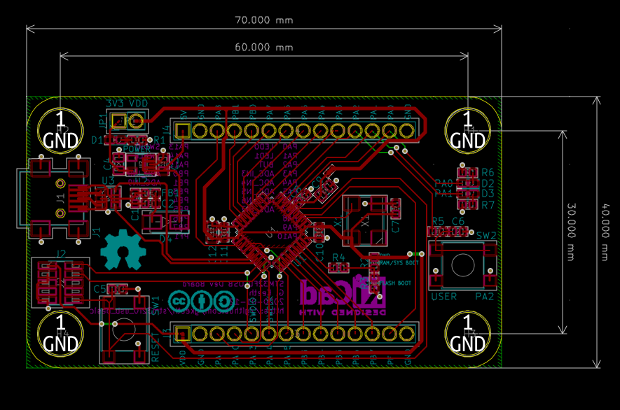
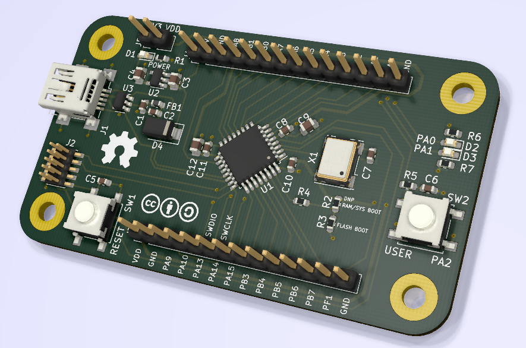

# stm32f0_usb_basic
Basic development board for STM32F042K6Tx (USB line)

No frills, basic dev board for STM32F0 USB line. Has a user button, two user LEDs, all GPIOs broken out, and not much else.

This work is licensed under a [Creative Commons Attribution-ShareAlike 4.0 International License][cc-by-sa].

[![CC BY-SA 4.0][cc-by-sa-image]][cc-by-sa]

[cc-by-sa]: http://creativecommons.org/licenses/by-sa/4.0/
[cc-by-sa-image]: https://licensebuttons.net/l/by-sa/4.0/88x31.png
